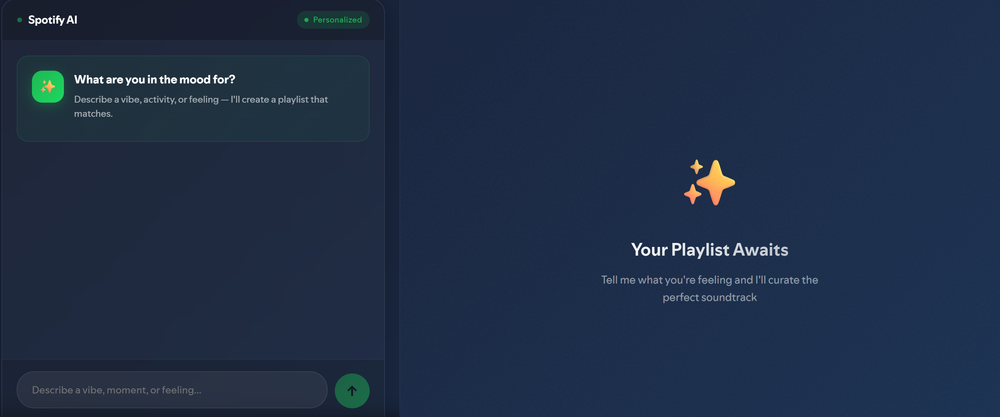
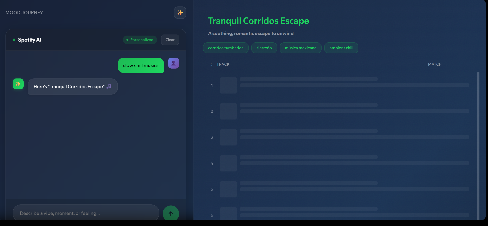
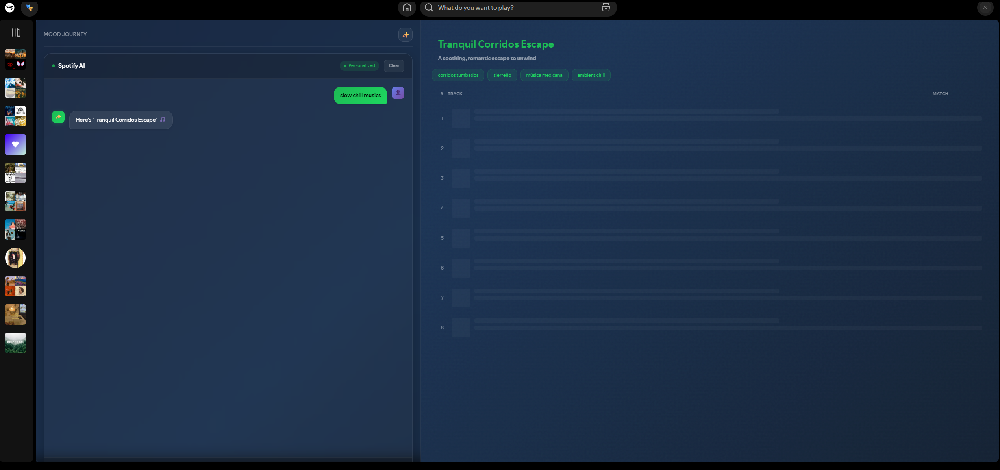
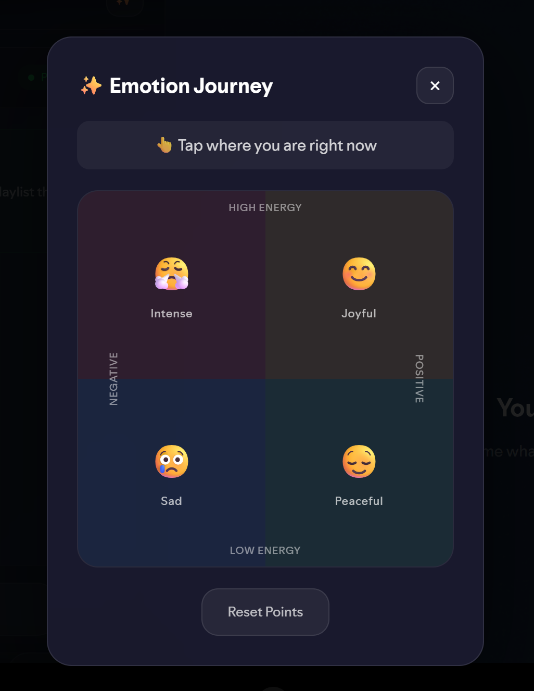
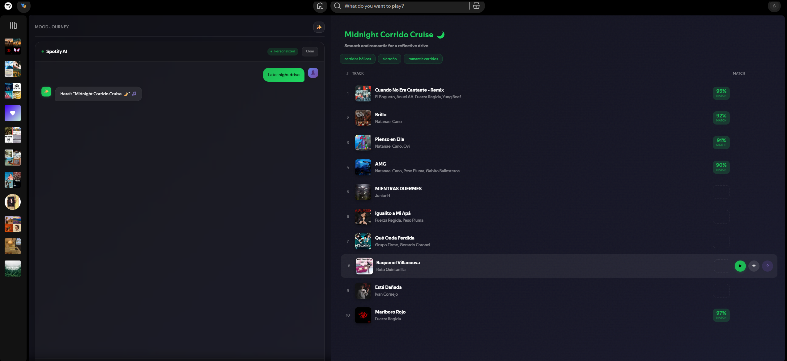
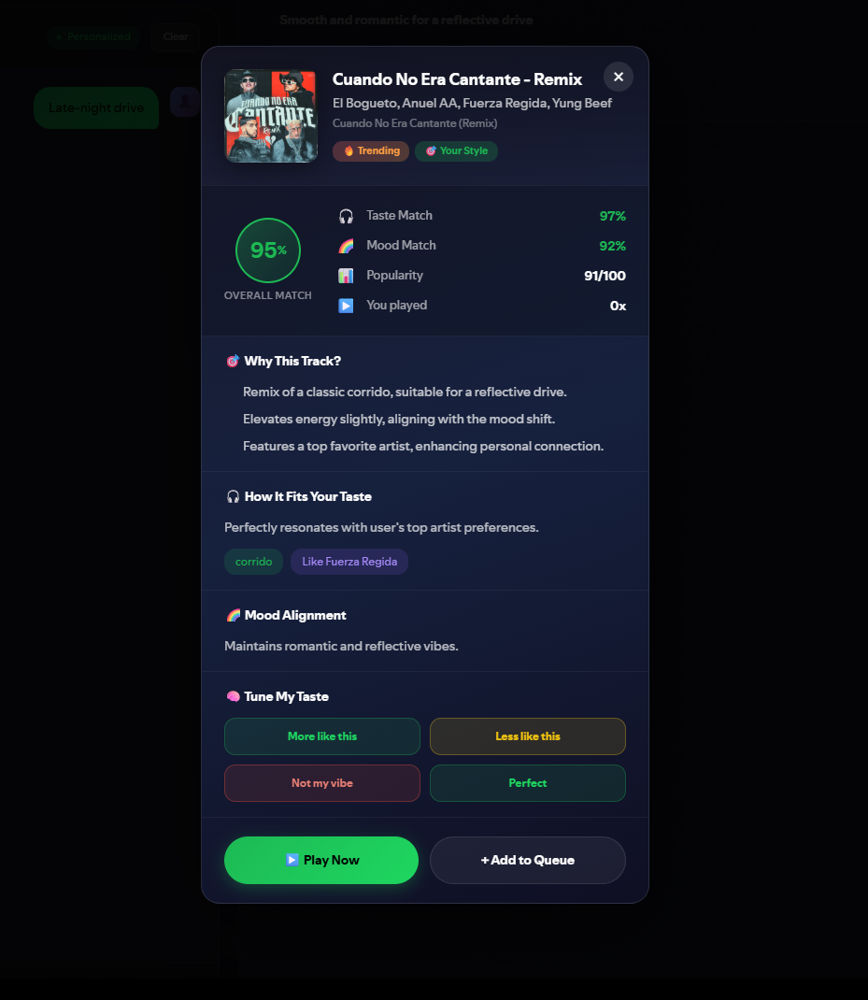
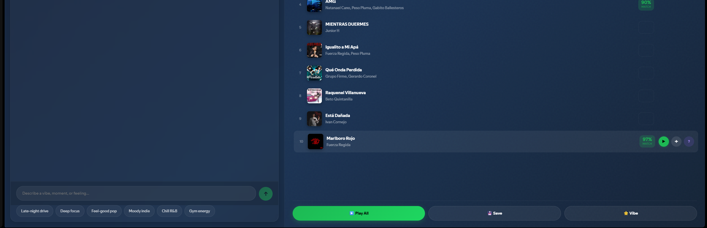

<div align="center">
  <h1>🎧 Spotify AI - Intelligent Music Discovery</h1>
  <p><strong>Your personal AI DJ</strong></p>
  


  
</div>

---

## 🌟 What is Spotify AI?

**Spotify AI** transforms how you discover music by combining the power of **LLMs** with **Spotify's vast music catalog** and **your personal listening history**. Simply describe what you need in plain language, and AI curates the perfect playlist tailored to your taste.

> *"I need focus music for coding"* → 🎵 10 perfectly matched tracks
> *"Ethiopian chill vibes"* → 🎵 Authentic Amharic music
> *"Energetic workout mix"* → 🎵 High-energy tracks that match your style

<div align="center">
  
</div>

---

## 🚀 AI Features

### 🎯 Natural Language Generation

Describe your mood, activity, or feeling in **plain language** - no complex filters or searches needed.

<div align="center">
  
</div>

**Examples:**

- *"Relaxing evening music for reading"*
- *"Upbeat French rap for my morning run"*
- *"Melancholic indie for a rainy day"*
- *"K-pop dance tracks for a party"*

### 🧠 Intelligent Mood Analysis

The AI understands **context** beyond just keywords:

- ⏰ **Time of Day** - Morning energy vs. evening calm
- 📅 **Day of Week** - Weekend vibes vs. weekday focus
- 🌤️ **Weather Conditions** - Rainy day moods, sunny energy
- 💭 **Emotional State** - Detected from your description
- 🎵 **Music Psychology** - Energy levels (0-1), Valence (-1 to 1)

<div align="center">
  
</div>

### 🎨 Personalized to YOUR Taste

Unlike generic playlists, Spotify AI learns from **your unique listening history**:

✨ **Taste Profile Analysis**

- Your top 50 artists
- Favorite genres and sub-genres
- Recent listening patterns
- Energy/valence preferences
- Preferred musical eras (2010s, 2020s, etc.)

✨ **Smart Balancing**

- 60% **Familiar** - Artists and genres you love
- 40% **Discovery** - New tracks aligned with your taste
- Adjustable discovery level (familiar/balanced/discovery)

✨ **Continuous Learning**

- Updates preferences after each generation
- Learns your favorite vibes and genres
- Adapts to your evolving taste

<div align="center">
  
</div>

### 🔄 Instant Regeneration

Not satisfied? Get a **completely different playlist** with the same vibe in one click:

- Same mood and style
- Fresh track selection
- New AI ranking
- Same personalization

<div align="center">
  
</div>

### 🎭 Transparent Explanations

Every track comes with **detailed reasoning**:

```
Track: "Yedi Gosh" by Aster Aweke
Overall Match: 98%

Why selected:
• Authentic Ethiopian/Amharic artist matching your request
• Soft, contemplative energy perfect for the mood
• Artist appears in your recent listening history
• High popularity ensures quality

Taste Alignment: 95% - "Matches your Ethiopian music taste"
Mood Fit: 92% - "Perfect for cloudy day introspection"
```

<div align="center">
  
</div>

---

### 💾 Smart Preferences Management

Your AI assistant remembers and learns:

- 🎵 **Saved Vibes** - Keep your last 5 favorite moods
- 🎸 **Genre Preferences** - Top 10 genres you enjoy
- ⚡ **Energy Levels** - Your preferred intensity (0-1)
- 🎭 **Mood Preferences** - Valence from melancholic to uplifting
- 📏 **Playlist Length** - 5-50 tracks (default: 10)
- 🔍 **Discovery Level** - How adventurous you want to be
- 📊 **Generation History** - Total playlists created

<div align="center">
  
</div>


## 🎵 Spotify Web Client Features

Built on top of a **Spotify Web Client** with:

### Core Features

- ▶️ **Real-time Playback** - Spotify Playback SDK integration
- 🎛️ **Full Controls** - Play, pause, skip, shuffle, repeat
- 🔍 **Search & Browse** - Explore millions of tracks, artists, albums
- 📝 **Playlist Management** - Create, edit, delete playlists
- ❤️ **Liked Songs** - Save and access your favorites
- 📱 **Multi-Device** - Switch between devices seamlessly
- 👤 **Artist Pages** - Full discography and related artists
- 💿 **Album Views** - Track listings and details

> **Note:** Premium Spotify account required for playback features

---

## 🛠 Technology Stack

### AI & Intelligence

- 🤖 **OpenAI** - Natural language understanding and curation
- 🧠 **Custom Generation Service** - Intelligent playlist creation
- 📊 **Taste Profiling** - User listening history analysis
- 🎯 **Smart Ranking** - Multi-factor track scoring

### Frontend

- ⚛️ **React 19** - Modern UI framework
- 📘 **TypeScript** - Type-safe development
- 🎨 **Ant Design** - Professional UI components
- 🔄 **Redux** - State management
- 💾 **Redux Persist** - Persistent storage

### Spotify Integration

- 🎵 **Spotify Web API** - Music data and user info
- 🔊 **Spotify Playback SDK** - Real-time playback control

---

## 📸 AI Feature Showcase

<div align="center">
  <table>
    <tr>
      <td align="center">
        
        <br/><b>Natural Language Input</b>
      </td>
      <td align="center">
        
        <br/><b>AI Processing</b>
      </td>
      <td align="center">
        
        <br/><b>Curated Playlist</b>
      </td>
    </tr>
    <tr>
      <td align="center">
        
        <br/><b>Selection Reasoning</b>
      </td>
      <td align="center">
        
        <br/><b>Emotion Mapping</b>
      </td>
      <td align="center">
        
        <br/><b>Save & Play</b>
      </td>
    </tr>
  </table>
</div>

---

## ⚙️ Installation & Setup

### Prerequisites

- Node.js 16+ and Yarn
- Spotify Premium account
- OpenAI API key

### Quick Start

1. **Clone the repository**

   ```bash
   git clone https://github.com/yeabwang/spotify_ai.git
   cd spotify_ai
   ```
2. **Install dependencies**

   ```bash
   yarn install
   ```
3. **Start the development server**

   ```bash
   yarn start
   ```
4. **Open your browser**

   Navigate to `http://localhost:3000`

5. **Configure your OpenAI API key**

   Go to **Settings** (⚙️) in the app and enter your OpenAI API key.
   
   **Get your API key:**
   - **OpenAI**: Get your API key from [OpenAI Platform](https://platform.openai.com/api-keys)
   
   > **Note:** Spotify integration is pre-configured. Just log in with your Spotify account!

### For Developers (Self-Hosting)

If you want to self-host with your own Spotify app, create a `.env` file:

```env
# Spotify Configuration (optional - pre-configured for hosted version)
REACT_APP_SPOTIFY_CLIENT_ID=<your_spotify_client_id>
REACT_APP_SPOTIFY_REDIRECT_URL=http://localhost:3000

# OpenAI Configuration (optional - users can enter in Settings)
REACT_APP_OPENAI_API_KEY=<your_openai_api_key>

# Optional: Customize OpenAI model (defaults to gpt-5.2-chat-latest)
# REACT_APP_OPENAI_MODEL=gpt-5
```

**Spotify Developer Setup:**
- Create an app at [Spotify Developer Dashboard](https://developer.spotify.com/dashboard/applications)
- Add your redirect URL (e.g., `http://localhost:3000`) to the app settings

**Customize AI behavior** (optional):
Modify `src/config/ai.config.ts` to adjust:
- Model selection and parameters
- Scoring weights (taste, mood, popularity, play frequency)
- Generation defaults (track count, discovery level)
- Preference storage settings

### Production Build

```bash
yarn build
```

The build files will be in the `build/` directory.

---

## 🎯 How to Use AI Features

### 1. Describe Your Need

Simply type what you want in natural language:

- *"Chill music for studying"*
- *"Upbeat workout tracks"*
- *"Relaxing Ethiopian music"*

### 2. AI Analyzes

The system:

- Loads your Spotify listening history
- Analyzes your taste profile
- Understands the mood and context
- Creates a personalized music plan

### 3. Get Your Playlist

Receive 10 perfectly curated tracks with:

- Overall match scores
- Detailed explanations
- Play/Save options

### 4. Refine (Optional)

- Regenerate for different tracks
- Adjust discovery level
- Update preferences
- Save favorite vibes

---

## 📚 Documentation

- **[Generation Service API](GENERATION_SERVICE_README.md)** - Detailed API documentation for developers
- **[Spotify Web API Docs](https://developer.spotify.com/documentation/web-api/)** - Official Spotify API reference
- **[OpenAI API Docs](https://platform.openai.com/docs)** - OpenAI API documentation

---

## 🤝 Shout out

This project is built upon the excellent **Spotify React Web Client** created by [Franco Borrelli](https://github.com/francoborrelli).

🙏 **Original Project:** [francoborrelli/spotify-react-web-client](https://github.com/francoborrelli/spotify-react-web-client)

## 🤝 Contributing

Contributions are welcome! Here's how you can help:

1. Fork the repository
2. Create a feature branch (`git checkout -b feature/amazing-feature`)
3. Commit your changes (`git commit -m 'Add amazing feature'`)
4. Push to the branch (`git push origin feature/amazing-feature`)
5. Open a Pull Request

## 📝 License

This project is licensed under the **MIT License** - see the [LICENSE](LICENSE) file for details.

---

## ⚠️ Important Notes

### Spotify Premium Required

- Playback features require a Spotify Premium subscription
- Free accounts can browse but cannot play music

### OpenAI API Costs

- AI features use OpenAI's API (configurable model)
- Each playlist generation makes 3-4 API calls
- Estimated cost varies by model
- Configure model and timeouts in src/config/ai.config.ts
- Consider implementing rate limiting for production

### API Rate Limits

- Spotify API: 180 requests per minute
- OpenAI API: Depends on your tier
- Built-in delays to prevent rate limiting

---

## 💬 Support

If you encounter any issues or have questions:

### AI Features (Generation, OpenAI, Preferences)

1. Check the [AI Documentation](GENERATION_SERVICE_README.md)
2. Review existing [Issues](https://github.com/yeabwang/spotify_ai/issues)
3. Open a new issue in [this repository](https://github.com/yeabwang/spotify_ai/issues/new)

### Web Client Features (Playback, UI, Spotify Integration)

1. Check the [original repository](https://github.com/francoborrelli/spotify-react-web-client)
2. Review existing [Issues](https://github.com/francoborrelli/spotify-react-web-client/issues)
3. Open a new issue in [Franco's repository](https://github.com/francoborrelli/spotify-react-web-client/issues/new)

---

## 🌟 Show Your Support

If you find this project useful, please consider:

- ⭐ Starring the repository
- 🐛 Reporting bugs
- 💡 Suggesting new features
- 🤝 Contributing code
- 📢 Sharing with others

---

<div align="center">
  <p>Made with ❤️</p>
</div>
